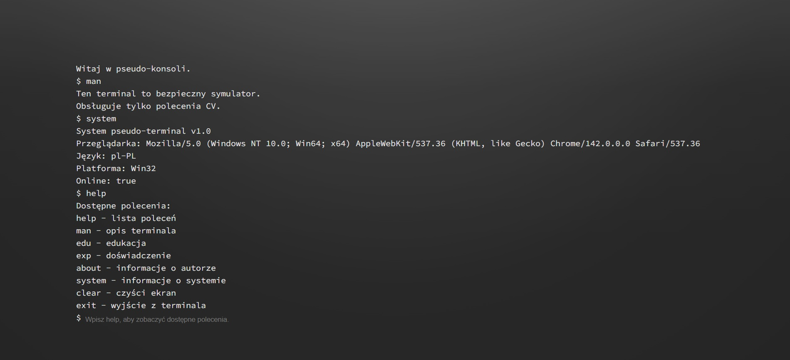

# Vue 3 + Vite

Interaktywny retro terminal napisany w Vue 3
- Działa jak konsola systemowa, ale wyświetla wybrane informacje na komendy
- Obsługuje komendy takie jak:
help — lista poleceń
about — informacje o autorze
edu — edukacja
exp — doświadczenie
clear — czyści ekran
theme — zmiana motywu kolorystycznego
exit - wyjście

Terminal potrafi:
- wykonywać powyższe komendy
- przeglądać historię komend ↑ ↓
- ustawiać motyw NOC / DZIEŃ

@AKC
@kania0507

